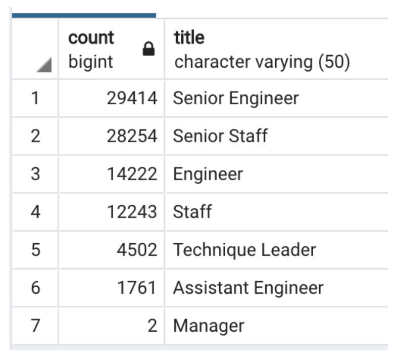
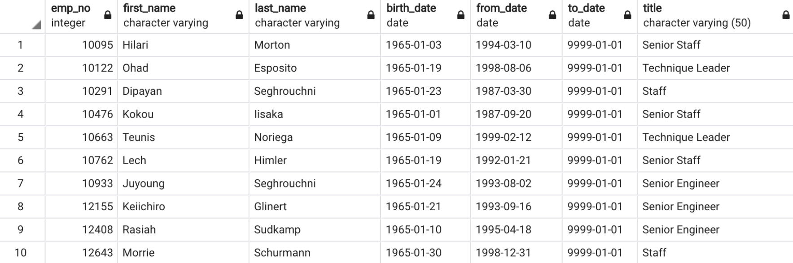

# Pewlett-Hackard-Analysis
# Overview of the analysis: 
The purpose of this analysis is to determine how many employees are retiring at the company.  We need to know which positions will have the largest vacancies and if there are individuals prepared to particpate in the mentorship program.  Understanding the changes that will soon be occuring within the company is important.   
# Results: 
* There are 90,398 employees that are going to be retiring soon. 
* There are seven departments that these employees will be retiring from. 
* There are 300,024 employees at Pewlett Hackard meaning roughly 30% will be retiring.  
* There are 2,846 employees that are eligble for the mentorship program.  
# Summary: 
# How many roles will need to be filled as the "silver tsunami" begins to make an impact?
There are seven roles that will be impacted from the number of employees that will be retiring.  Senior engineer and senior staff are the two positions that will be impacted the most.  

 

# Are there enough qualified, retirement-ready employees in the departments to mentor the next generation of Pewlett Hackard employees?
There are only 2,846 employees that are eligible for the mentorship program, which leaves 206,780 at the company that are neither retiring or part of the program.  If the company is looking to replace all retiring employees then new hires will need to be added.     
There are only two managers that are retiring and we will need to create a plan to make sure new employees are properly trained.  

 
